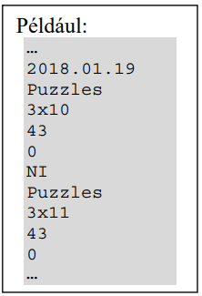
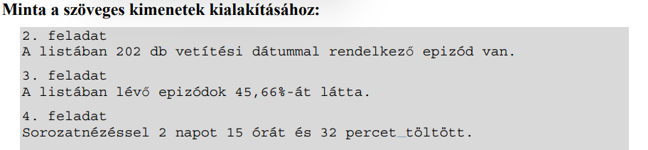

# Sorozatok

Sok olyan sorozatrajongó van, aki folyamatosan követi a kedvelt sorozatait. Egy, az angol
nyelvű sorozatokért rajongó személy feljegyzést készített egy nyolc hónapos időszak kedvenc
sorozatairól.

A lista.txt fájl a rajongó által kedvelt sorozatok adásba
kerülésének dátumát, a sorozat angol címét, az évadot és az epizód
számát, az epizód hosszát percben és egy jelzést tartalmaz, hogy a lista
készítője megnézte-e már azt az epizódot. Ezek az adatok egymás után
külön sorokban szerepelnek. A fájlban biztosan 400-nál kevesebb
epizódról van adat, epizódonként 5 sorban.

A példában látható, hogy a Puzzles című sorozat 3. évadának 10. 
epizódja 2018. 01. 19-én került adásba. Az epizód 43 perces, és
még nem nézte meg a lista készítője. 

- A dátumokat mindig „éééé.hh.nn” formátumban rögzítették.
Vannak olyan sorozatrészek, amelyeknek a lista rögzítésekor
még nem tudták az adásba kerülésük idejét. Ezeknél a dátum
helyett mindig az „NI” rövidítés szerepel.
- Az évad jelzése vezető nullák nélkül történik, az epizód számát pedig mindig két
számjeggyel rögzítették. Az évad és az epizód számát egy „x” választja el egymástól.
- Az egyes sorozatok epizódjai mindig ugyanolyan hosszúak.
- Az epizóddal kapcsolatos utolsó adat értéke „0” vagy „1”. Az 1-es számjegy jelöli,
hogy az adott részt már megtekintette a lista készítője, a 0 pedig azt, hogy még nem
látta.

Készítsen programot a lista.txt állomány adatainak feldolgozására! A program
forráskódját mentse sorozatok néven! (A program megírásakor a felhasználó által megadott
adatok helyességét, érvényességét nem kell ellenőriznie, feltételezheti, hogy a rendelkezésre
álló adatok a leírtaknak megfelelnek.)

A képernyőre írást igénylő részfeladatok eredményének megjelenítése előtt írja a képernyőre
a feladat sorszámát (például 2. feladat:)! Ha a felhasználótól kér be adatot, jelenítse meg
a képernyőn, hogy milyen értéket vár! Az ékezetmentes kiírás is elfogadott. 

1. Olvassa be és tárolja el a lista.txt fájl tartalmát! 
2. Írassa ki a képernyőre, hogy hány olyan epizód adatait tartalmazza a fájl, amelynek ismert
az adásba kerülési dátuma!
3. Határozza meg, hogy a fájlban lévő epizódok hány százalékát látta már a listát rögzítő
személy! A százalékértéket a minta szerint, két tizedesjeggyel jelenítse meg a képernyőn! 
4. Számítsa ki, hogy összesen mennyi időt töltött a személy az epizódok megnézésével!
Az eredményt a minta szerint nap, óra, perc formában adja meg! 

